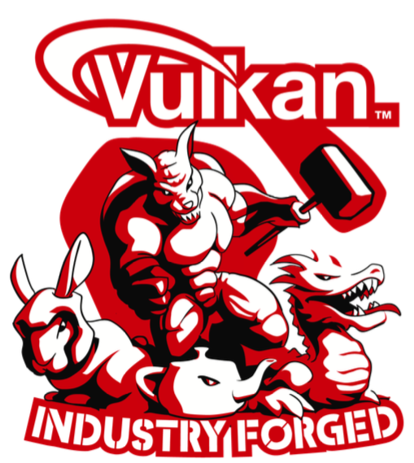
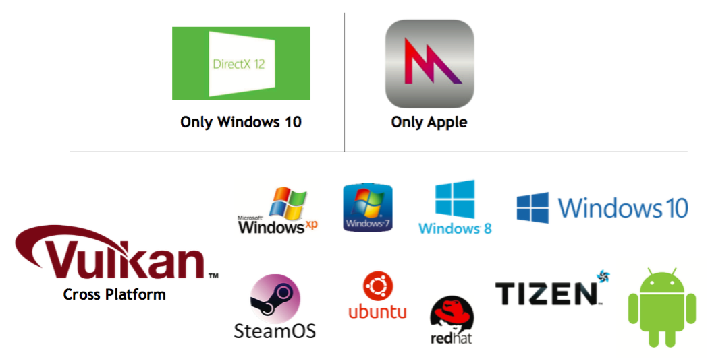

## 新一代图形API Vulkan 对行业的影响
Vinjn张静 [@github](https://github.com/vinjn) / [@zhihu](https://www.zhihu.com/people/vinjn) / [mail](mailto:vinjn.z@gmail.com)
========
### 议程
* Vulkan 介绍
* 为什么重新造轮子？
* 开放的生态圈
* 展望未来
* Q & A
========
### Vulkan 介绍

========
### 成立的背景
* 2012 年 10 月，成立 GL Common TSG 重新设计 GL / ES，不了了之
* 2014 年 6 月，项目重启，改名为 GL Next，提升优先级
* 2015 年 GDC，重命名为 Vulkan
* 2016 年 2 月，正式发布
========
### Vulkan 是为今后 20 年准备的图形 API
* 是 OpenGL / OpenGL ES 的替代者
* 现代、高效的设计
* 开放的工业标准
========
### 和 OpenGL 的不同
* 设计哲学上本质的改变
* 需要应用开发者做出相应改变
========
### 为什么重新造轮子，OpenGL 出了什么问题？
========
### 25 年前 OpenGL 被发明了

========
### GPU 逐渐移动化、多核化

========
### GPU 被用于各种领域（图像、计算、视觉、深度学习等等）

========
### 问题 1：OpenGL 编程模型与 GPU 硬件不一致
* 尤其在移动端
* 被驱动的黑魔法隐藏
========
### 问题 2：驱动工作量过大
* 大量的状态检验
* 资源依赖跟踪
========
### 问题 3： 驱动不稳定
* 逻辑复杂
* 大量 bug
* 难以预测的行为
* 每个 GPU 都有不同的 bug
* 每个 GPU 都有自己推荐的编程方式
========
### 问题 4： 单线程
* 需要创建 context
* context 需要和线程绑定
* 无法高效利用多核 CPU
========
### 解决方案：对硬件的直接控制
* 你需要做什么？
* 驱动会做什么?
========
### 你需要
* 在合适的时间
* 告诉 Vulkan 驱动你打算做什么
* 提供足够的细节
* 驱动不需要猜测
========
### OpenGL 则允许你
* 在任意时间提供重要信息
* 在任意时间改变这些信息
* 方便，但是严重影响 GPU 性能
========
### 相应的，Vulkan 驱动保证会
* 在你让它工作时
* 做该做的事情
========
### OpenGL 驱动则
* 会延迟工作
* 将工作转移给另一个线程
* 甚至基于猜测，无视你的命令
========
### Vulkan 的编程模型（简化版）
* Instance
    * PhysicalDevice
        * Device
            * Resources (Image, Buffer)
            * Memory
            * Queue
            * Command Buffer
========
### Queue, Command Buffer

========
### Vulkan 的生态圈是开放的
* [https://github.com/KhronosGroup](https://github.com/KhronosGroup)
* Loader
* Validation layer
* SPIR-V 工具
* Conformance 测试集
* Specification
========
### Vulkan 工作组成员

========
### 整个行业的努力
* GPU 和 SoC 供应商
* 游戏开发商
* 引擎和工具开发商
* 平台
* 内容提供商
========
### 我对生态圈的贡献
* vktrace
* awesome-vulkan
* vkut
========
### vktrace
* https://github.com/LunarG/VulkanTools/tree/master/vktrace
* Vktrace Trace and Replay Tool
* Vktrace is a Vulkan API tracer for graphics applications.
========
### awesome-vulkan
* https://github.com/vinjn/awesome-vulkan
* 收集互联网上有关 Vulkan 的（几乎）所有公开资源：
    * Hardware Support
    * SDK
    * IHV Document
    * Tutorial
    * Apps
    * Samples
    * Libraries
    * Bindings
    * Tools
========
### vkut
* https://github.com/vinjn/vkut
* The Vulkan Utility Toolkit
========
### Vulkan 对未来 AR 应用的帮助
* 省电
* 支持 Compute Shader，可以进行计算机视觉运算
* OpenCV CUDA / OpenCL 模块 -> Vulkan 模块
* 支持异步计算（Async Compute)，充分榨干 GPU 性能
========
### Vulkan 对未来 VR 应用的帮助
* 省电
* 稳定的帧率、可预测的性能确保流畅的 VR 体验
* 多线程的引入使得同屏 drawcall 更多
* Android N 引入 Daydream 和 Vulkan，标志着 Vulkan 将应用在安卓 VR 中 
========
### 展望未来，你是否应该使用 Vulkan?
* 挑战
* 机遇
* 现实
========
### 挑战
* 啰嗦、复杂的编程方式
* 容易伤到自己
* 需要重新学习知识
========
### 机遇
* 驱动的负担更轻
* 可以通过多线程进一步降低
* 可预测的性能
* 对移动端友好
========
### 现实
* 生态圈还不如 OpenGL 成熟
* 短时间内依然需要发布 GL / DX 版本
========
### Vulkan vs OpenGL / ES

========
### Vulkan vs DirectX12 vs Metal

========
## Q & A
> https://github.com/vinjn/slides
