## 次世代图形接口 Vulkan 对行业的影响

张静  
GPU 架构师 @ NVIDIA
========
### README
* @ NVIDIA 上海
* 负责硬件部门的 OpenGL / Vulkan 性能分析工具
* 游戏行业经验
 * 2K Games
 * Ubisoft
 * 微软 Xbox 部门
* 译者
 * OpenCV 2 计算机视觉编程手册
 * Processing 语言权威指南
* 联系方式
 * https://github.com/vinjn
 * https://www.zhihu.com/people/vinjn
 * vinjn.z@gmail.com
 * 知乎专栏 / 微信订阅号：黑客与画家
========
### 三个问题
* Vulkan 是什么？
* Khronos 为什么重新造轮子？
* 什么项目需要用 Vulkan？
========

========
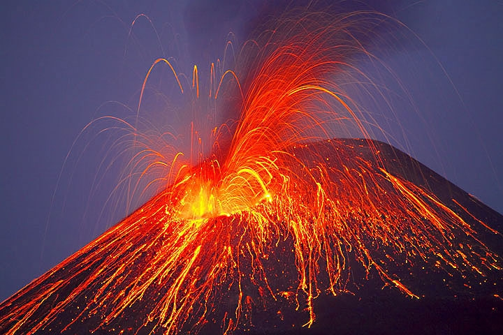

Vulkan - 德语中的火山 - 不是福尔康

========
### Vulkan 是为今后 20 年准备的图形接口
* 是 OpenGL / ES 的替代者
* 现代、高效的设计
* 开放的工业标准
* 跨平台（除了苹果系统……）
========
### 成立的背景
* 2012 年，Khronos 成立项目组重新设计 OpenGL，不了了之
* 2014 年，项目提升至最高优先级，重启为 GL Next
* 2015 年 GDC，首次对外公开项目细节
* 2016 年 GDC，发布 1.0
 * 得到硬件厂商支持
 * 得到游戏厂商支持
 * 得到工具厂商支持
========


 > 新面孔：Google, Nintendo, PIXAR, Oculus VR, Valve, EA, Blizzard
========
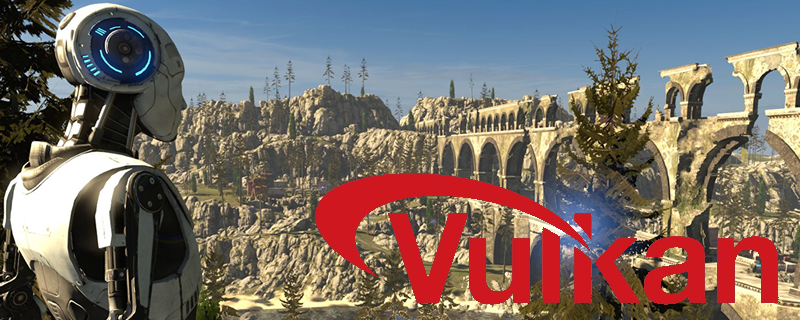

The Talos Principle
========
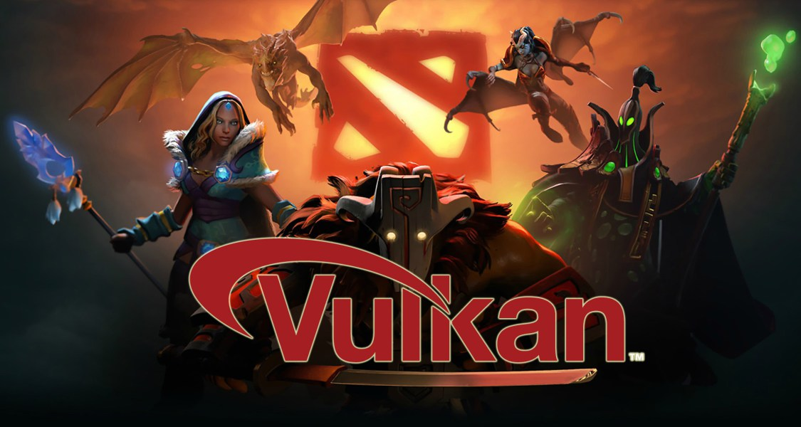

Dota2
========
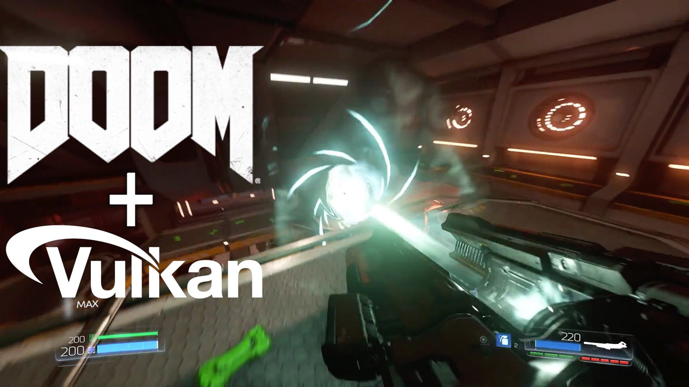
Doom
========
# OGL 出了什么问题？
========
### 问题 一：OpenGL 编程模型与 GPU 硬件不一致
========
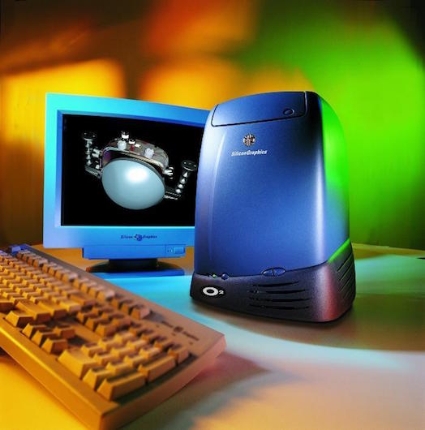

OpenGL 被发明于 25 年前，用于昂贵的图形工作站中。

========
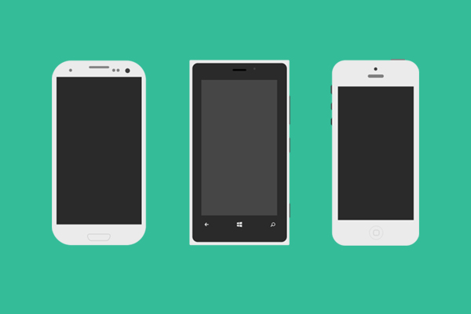

近年来移动 GPU 的兴起，多核 CPU 也成为常态，而 OpenGL 还是没变。

========
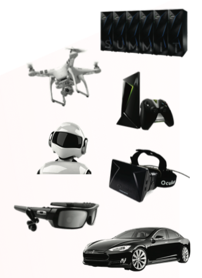

GPU 甚至被用于图形以外的领域，无人机、计算机视觉、汽车、深度学习等，OpenGL 无能为力。

========
### 解决方法，Vulkan 使用接近硬件的编程模型

========
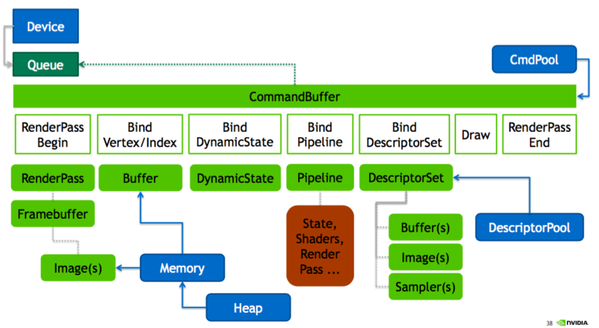
========
### 问题 二：驱动工作量过大，行为难以预测
========
### 原因在于
* OpenGL 开发者
	* 在任意时间提供重要信息
	* 在任意时间改变这些信息
	* 对 GPU 不友好
* OpenGL 驱动
	* 会延迟工作，将工作转移给另一个线程
	* 甚至基于猜测，无视开发者的命令
	* 为了满足灵活性，增加大量的状态检验
	* 跟踪资源之间的依赖
========
### 解决方法
* 开发者通过 Vulkan 实现对硬件的直接控制
	* 在合适的时间
	* 告诉驱动打算做什么
	* 提供足够的细节
* Vulkan 驱动会
	* 在你让它工作时
	* 做该做的事情
	* 不做猜测，猜测 ＝ 浪费
========
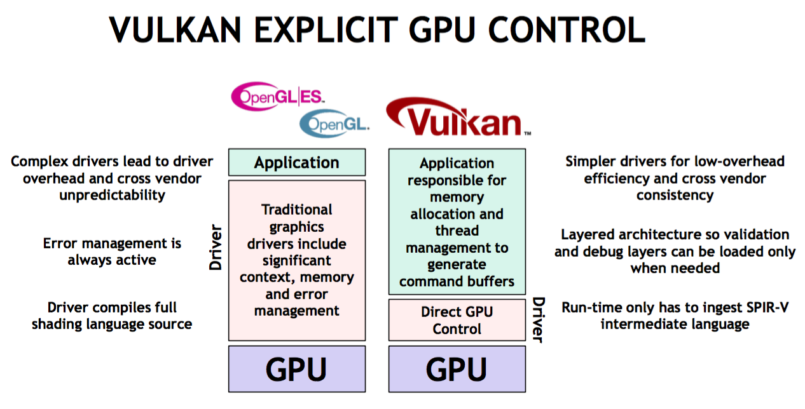
========
### 举例：OpenGL 的状态机被 PSO 取代
* OpenGL 中的状态改变是全局的，在 Vulkan 中被 Pipeline State Object（PSO）替代
	* 强迫你提前准备渲染的状态
	* 你的工作量上去了
	* 驱动的工作量降低了，更好优化、更快
* OpenGL
```C++
// 可随时随地修改渲染状态
glPolygonMode(GL_FRONT_AND_BACK, GL_LINE/GL_FILL);
```
* Vulkan
```C++
// 预先创建两个 PSO 对象
vkCreateGraphicsPipelines(...&pipelineCreateInfo, ..., &pipelines.solid);
rasterizationState.polygonMode = VK_POLYGON_MODE_LINE;
vkCreateGraphicsPipelines(...&pipelineCreateInfo, ..., &pipelines.wireFrame);
// 之后方可通过 PSO 来设置渲染状态
vkBeginCommandBuffer();
vkCmdBindPipeline(...&pipelines.active...);
vkEndCommandBuffer();
```
========
### 问题 三： OpenGL 对多线程不友好
* 需要创建 GL Context
* Context 需要和线程绑定
* 无法高效利用多核 CPU
========
### 答案：Queue, Command Buffer
* 所有对象对任何线程都可见，没有 Thread-local storage（TLS）
* 比如：Command Buffer 的录制可以在任意线程进行，不需要绑定 Context
* 多线程的对象同步成为开发者的职责
========

========
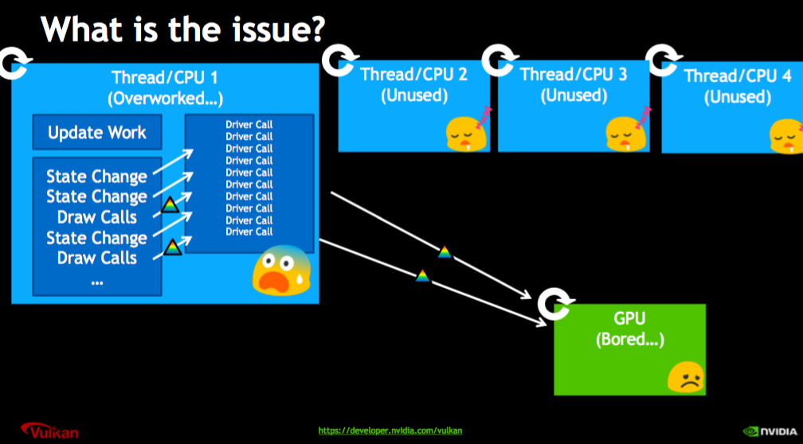
========
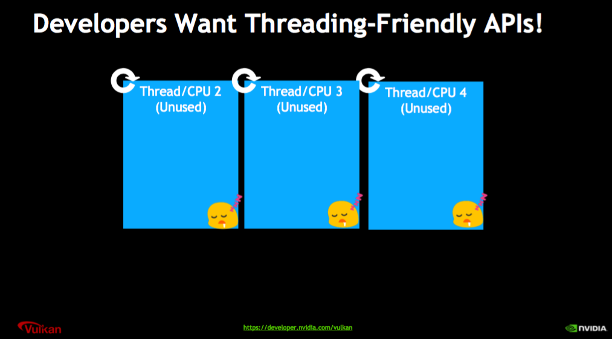
========
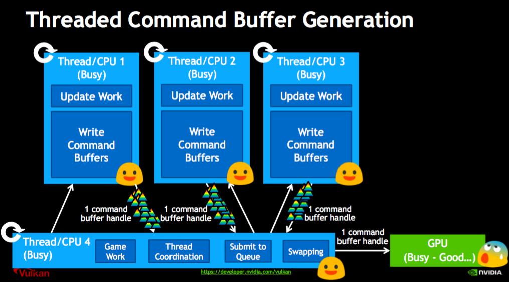
========
### Vulkan 对特定应用的优化
* 支持 Compute Shader，可以进行计算机视觉运算
* 支持异步计算 (Async Compute)，充分榨干 GPU 性能
* Android N 引入 Daydream 和 Vulkan，标志着 Vulkan 将应用在安卓 VR 中 
========
### 省电，CPU 端工作量减少
* 驱动工作量减少
	* 减少错误检查
	* 减少资源跟踪
* 多线程，充分利用 CPU 时间
========
### 稳定的帧率、可预测的性能，确保流畅的 VR 体验
* 多线程的引入使得同屏 drawcall 更多
* 复用 command buffer
* 驱动不会猜测你的行为
========
# 是否需要用 Vulkan?
========
### 挑战
* 复杂的编程方式
* 容易伤到自己
* 需要重新学习知识
========
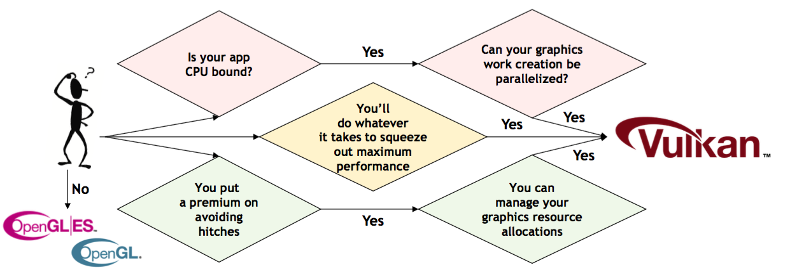

！并不是所有 OpenGL 应用都需要转成 Vulkan！

========
### 机遇
* 通过让开发者做更多工作，让硬件做更多工作
* 可以通过多线程进一步降低
* 可预测的性能
* 对移动端友好
* 可以参与到开放的社区中
========
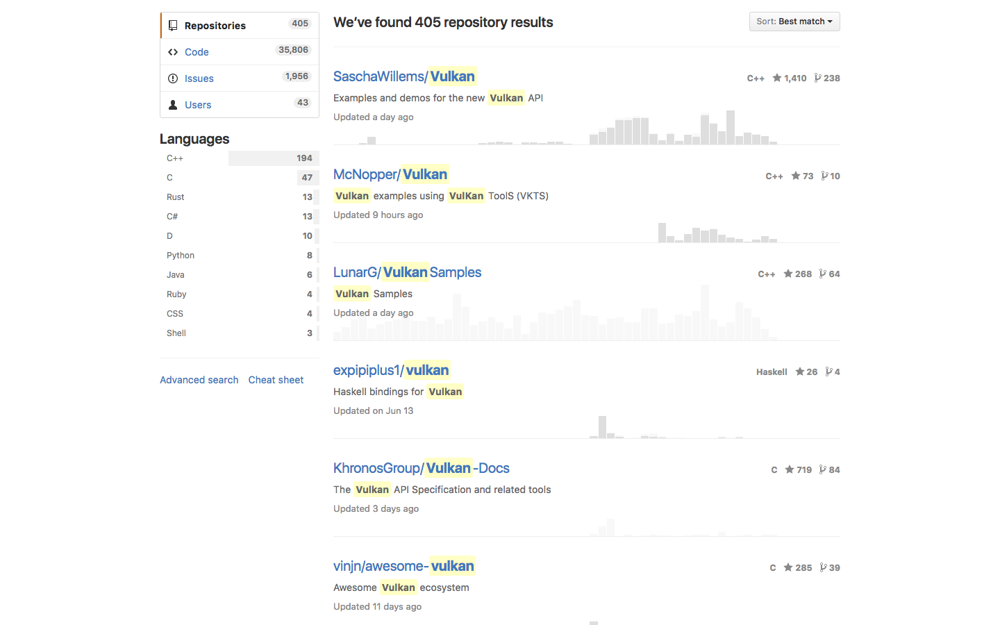

========
### 现实
* 生态圈还不如 OpenGL 成熟
* 短时间内依然需要发布 GL / DX 版本
* 行业趋势
	* Apple - Metal
	* Android - Vulkan
	* Windows - DirectX 12
	* 传统应用 - OpenGL
========
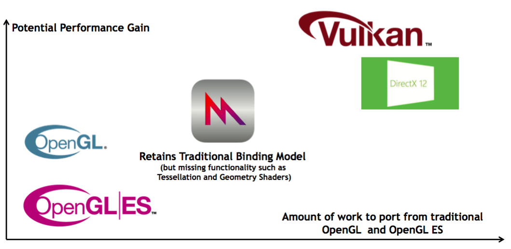

Vulkan vs OpenGL / ES
========


Vulkan vs DirectX12 vs Metal
========


Thanks
========
#### 微信公众号“黑客与画家”
#### 关注游戏开发、计算机视觉、图形学、虚拟现实等。

> https://github.com/vinjn/slides


